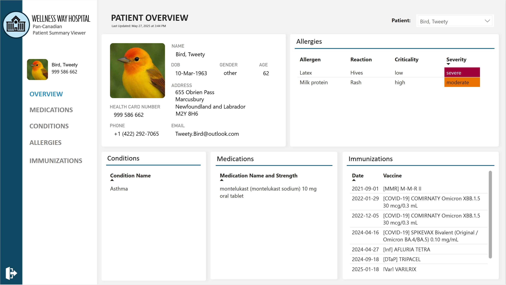
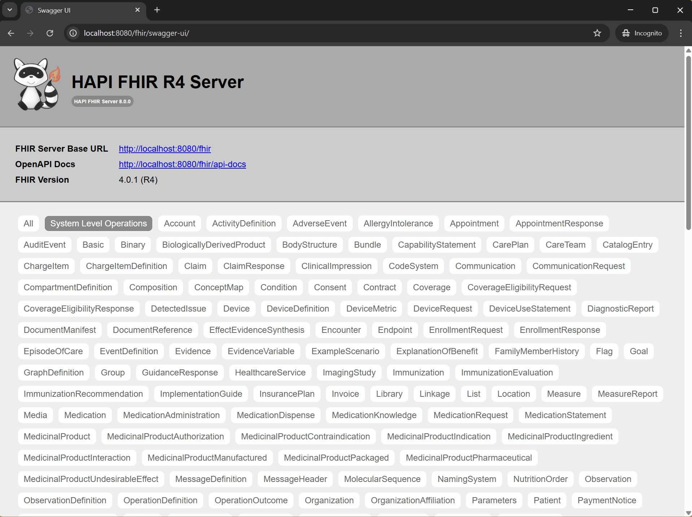

# Patient Summary App

This project generates synthetic HL7 FHIR-based patient summaries aligned with the Pan-Canadian Patient Summary (PS-CA) standard. It posts them to a HAPI FHIR server, which is used as the data source for a Patient Viewer dashboard built with Microsoft Power BI.



## Features
- Creates FHIR Patient Summary Bundles based on synthetic patient data aligned with PS-CA value sets
- Posts bundles to HAPI FHIR server
- Connects to connects to HAPI FHIR server using Power Query in Microsoft Power BI, unpacks .json into tables, and visualizes the data.

## Requirements
- Python 3.x
- Docker (for running HAPI FHIR server)
- Python packages listed in `requirements.txt`
- Microsoft Power BI desktop

## Getting Started

### 1. Clone the repository

```bash
git clone https://github.com/ITNurse/patient-summary-app.git
cd patient-summary-app
```

### 2. Set up your Python environment

It’s recommended to use a virtual environment:

```bash
python -m venv venv
venv\Scripts\activate      # On Windows
# source venv/bin/activate   # On macOS/Linux

pip install -r requirements.txt
```

### 3. Install Docker (if you haven’t already)

Docker is required to run the HAPI FHIR server locally.

- Download and install Docker Desktop from:  
  [https://www.docker.com/products/docker-desktop](https://www.docker.com/products/docker-desktop)

- After installing, make sure Docker is **running** in the background.  
  Look for the whale 🐳 icon in your system tray (Windows/macOS).

### 4. Start the HAPI FHIR server (via Docker)

```bash
docker run -d -p 8080:8080 hapiproject/hapi:latest
```
Wait a couple of minutes for the server to start, then open a web browser and navigate to `http://localhost:8080/fhir` to ensure it is running. You should see something like this:




### 5. Run the application

```bash
python main.py
```

### 6. Output

FHIR Bundles will be created in the `document_bundles/` folder and POSTed to the FHIR server.

### 7. Open and Refresh the Power BI Report

The Power BI report file is located in the `powerbi/` folder.

To open and refresh the report:

1. Open `powerbi/patient-summary-report.pbix` in Power BI Desktop.
2. Click **Refresh** to load data directly from your running FHIR server.
3. If prompted, select **Web** as the data source type and ensure the FHIR server (e.g., `http://localhost:8080/fhir`) is running.

> **Note:** Some fields (e.g., `identifier`) may not appear correctly if you're connecting to a summary endpoint. Connect directly to each resource endpoint for full access.

## License
MIT

# Learn More

- [What is the Pan-Canadian Patient Summary?](docs/pan-canadian-patient-summary.md)
- [CSV File Design Decisions and Value Sets](docs/csv-design-and-value-sets.md)
- [Using the HAPI FHIR Server](docs/hapi-server.md)
- [How the Python App Works](docs/python-pipeline.md)
- [Using Power Query and Power BI](docs/power-query-bi.md)

