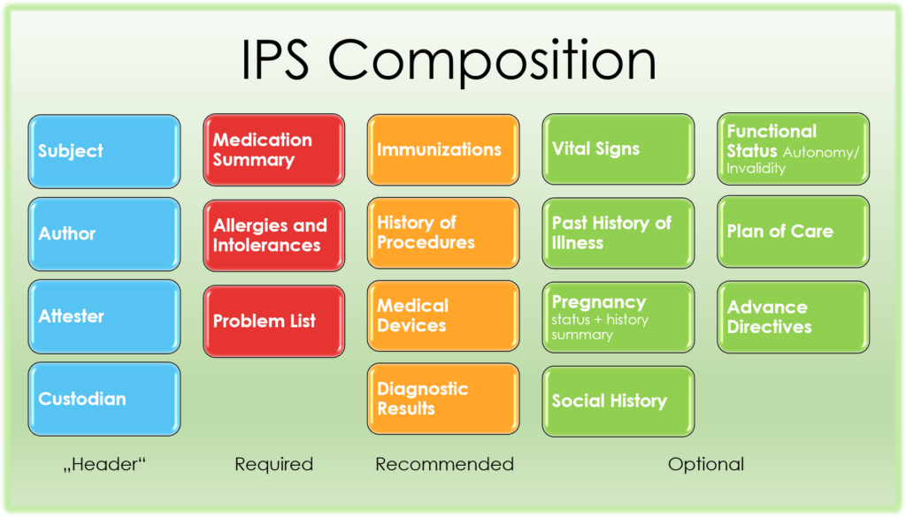
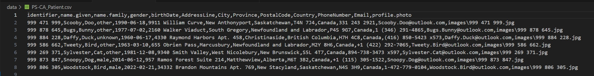

# CSV File Design Decisions
This section identifies the rationale behind why the csv files used as the base patient data for the patient summaries were created as they were.

## PS-CA Implementation Guide
The Trial Implementation version (v1.0.0 TI) of the [PS-CA implementation guide](https://simplifier.net/guide/pan-canadian-patient-summary-v1.0-ti-fhir-implementation-guide?version=1.0.0) and the associated resource definitions on simplifier.net were used as the basis for all design decisions. The PS-CA is closely aligned with the [International Patient Summary (IPS) Implementation Guide](https://hl7.org/fhir/uv/ips/), which indicates that every IPS must include the following sections: Header (subject, author, attester, custodian), Medication Summary, Allergies & Intolerances, and Problem List.

Therefore, the following FHIR resources are required for the PS-CA:
- [CompositionPSCA](https://simplifier.net/ps-ca-r1/compositionpsca)
- [PatientPSCA](https://simplifier.net/ps-ca-r1/patientpsca)
- [MedicationStatementPSCA](https://simplifier.net/ps-ca-r1/medicationstatementpsca)
- [AllergyIntolerancePSCA](https://simplifier.net/ps-ca-r1/allergyintolerancepsca)
- [ConditionPSCA](https://simplifier.net/ps-ca-r1/conditionpsca)

All of these resources are grouped together as a [BundlePSCA](https://simplifier.net/ps-ca-r1/bundlepsca) resource.

In an effort to make this project a more well-rounded educational resource, the following two resources were also created:
- [ImmunizationPSCA](https://simplifier.net/ps-ca-r1/immunizationpsca)
- [OrganizationCACore](https://simplifier.net/ca-core/organization-ca-core)

## PS-CA_Composition.csv
[Enter screenshot here]
### PS-CA Composition Resource Specification
The fields selected for the PS-CA_Composition.csv file correspond to those marked as Required in the PS-CA Composition profile. The values entered conform to the expected data types and, where applicable, to the specified value set bindings. Details are outlined in the table below:
| Field                                                   | Type           | Requirement | Notes                                                                                                                                                              |
|---------------------------------------------------------|----------------|-------------|--------------------------------------------------------------------------------------------------------------------------------------------------------------------|
| `CompositionPSCA.subject.reference`                     | `string`       | Required    | A reference to a location at which the other resource is found                                                                                                     |
| `CompositionPSCA.status`                                | `code`         | Required    | Required Binding: [CompositionStatus](http://hl7.org/fhir/composition-status)   Allowed: `preliminary`, `final`, `amended`, `entered-in-error`              |
| `CompositionPSCA.type`                                  | `CodeableConcept` | Required | Preferred Binding: `FHIRDocumentTypeCodes`   Includes codes from LOINC (where SCALE_TYP = "Doc")                                                                     |
| `Composition.date`                                      | `dateTime`     | Required    |                                                                                                                                                                    |
| `CompositionPSCA.author`                                | `Reference`    | Required    | Must reference: `PractitionerProfile`, `PractitionerRoleProfile`, `Device`, `PatientPSCA`, `RelatedPerson`, or `OrganizationProfile`                              |
| `CompositionPSCA.title`                                 | `string`       | Required    |                                                                                                                                                                    |
| `CompositionPSCA.section`                               | `BackboneElement` | Required | Sections comprising the PSCA                                                                                                                                        |
| `Composition.section:sectionMedications.title`          | `string`       | Required    |                                                                                                                                                                    |
| `Composition.section:sectionMedications.code`           | `CodeableConcept` | Required | Required Binding: [DocumentSectionCodes](https://simplifier.net/packages/hl7.fhir.r4.core/4.0.1/files/2831879)                                                             |
| `Composition.section:sectionAllergies.title`            | `string`       | Required    |                                                                                                                                                                    |
| `Composition.section:sectionAllergies.code`             | `CodeableConcept` | Required | RequiredBinding: [DocumentSectionCodes](https://simplifier.net/packages/hl7.fhir.r4.core/4.0.1/files/2831879)                                                             |
| `Composition.section:sectionProblems.title`             | `string`       | Required    |                                                                                                                                                                    |
| `Composition.section:sectionProblems.code`              | `CodeableConcept` | Required | RequiredBinding: [DocumentSectionCodes](https://simplifier.net/packages/hl7.fhir.r4.core/4.0.1/files/2831879)                                                             |

## PS-CA_Organization.csv
[Enter screenshot here]

### Organization Resource
[Enter table here]

## PS-CA_Patient.csv

### Patient Resource
The fields selected for the PS-CA_Composition.csv file correspond to those marked as Required in the PS-CA Patient profile, along with a few others to round out example for educational purposes. The values entered conform to the expected data types and, where applicable, to the specified value set bindings. Details are outlined in the table below:

| Field                                        | Type           | Requirement  | Notes                                                                                                                                              |
|---------------------------------------------|----------------|--------------|----------------------------------------------------------------------------------------------------------------------------------------------------|
| `Patient.name`                              | `string`       | Required     | Used `patient.name.family` and `patient.name.given`                                                                                                |
| `Patient.birthDate`                         | `date`         | Required     |                                                                                                                                                    |
| `Patient.gender`                            | `code`         | Not required | Required Binding: [AdministrativeGender](http://hl7.org/fhir/administrative-gender)   Allowed: `male`, `female`, `other`, `unknown`                 |
| `Patient.contact.telecom.system`            | `code`         | Not required | Required Binding: [ContactPointSystem](http://hl7.org/fhir/contact-point-system)   Allowed: `phone`, `fax`, `email`, `pager`, `url`, `sms`, `other`     |
| `Patient.contact.telecom.value`             | `string`       | Not required |                                                                                                                                                    |
| `Patient.contact.address.city`              | `string`       | Not required |                                                                                                                                                    |
| `Patient.contact.address.line`              | `string`       | Not required |                                                                                                                                                    |
| `Patient.contact.address.state`             | `string`       | Not required |                                                                                                                                                    |
| `Patient.contact.address.postalCode`        | `string`       | Not required |                                                                                                                                                    |
| `Patient.contact.address.country`           | `string`       | Not required |                                                                                                                                                    |
| `Patient.photo.contentType`                 | `code`         | Not required | Binding: *Mime Types* value set (Required Binding)                                                                               |
| `Patient.photo.data`                        | `base64Binary` | Not required |                                                                                                                                                    |
| `Patient.identifier.system`                 | `uri`          | Required     |                                                                                                                                                    |
| `Patient.identifier.value`                  | `string`       | Required     |                                                                                                                                                    |

## PS-CA_Medication.csv
[Enter screenshot here]

## Medication Resource
[Enter table here]

## PS-CA_Condition.csv

## Condition Resource
### Condition Profile Fields and Bindings

| Field                                        | Type           | Requirement  | Notes      |
|---------------------------------------------|----------------|--------------|-------------|
| `Condition.subject.reference`            | `string`       | Required     | A reference to a location at which the other resource is found  |
| `Condition.code`                         | `date`         | Required     | Preferred Binding: Clinical Finding Code    This subset was defined using the intensional definition of `404684003 | Clinical finding (finding)` against the substrate SNOMED CT Canadian Edition.   This resource is an informative value set; a normative subset containing the expanded values can be found on Canada Health Infoway's Terminology Gateway.   [https://fhir.infoway-inforoute.ca/ValueSet/clinicalfindingcode](https://fhir.infoway-inforoute.ca/ValueSet/clinicalfindingcode) |
| `Condition.code.coding.system`          | `uri`         | Required | |
| `Condition.code.coding.code`            | `code`         | Required | |
| `Condition.code.coding.display`             | `string`       | Required |  |

## PS-CA_AllergyIntolerance.csv
[Enter screenshot here]

### Allergy Intolerance Resource
[Enter table here]

### PS-CA_Immunization.csv
[Enter screenshot here]

## Immunization Resource
[Enter table here]