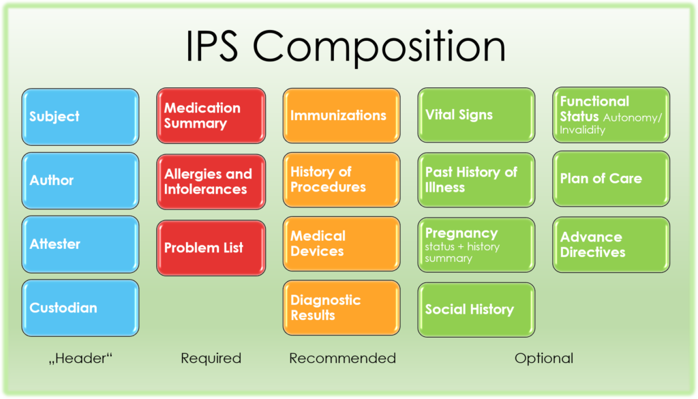

# CSV File Design Decisions
This section explains the rationale behind the structure and content of the CSV files used to generate synthetic patient data for the PS-CA Patient Summary Viewer. Each file corresponds to a FHIR resource type required by the PS-CA Implementation Guide (IG), including Composition, Patient, MedicationStatement, Condition, and AllergyIntolerance. Additional files for Organization and Immunization were included to broaden the educational scope.

The data was manually created using Windows Notepad to ensure full control over each record and to make the files easy to explore with tools like Microsoft Excel. This approach supports transparency and helps learners understand how each data element maps to the PS-CA profiles and value sets.

Only fields marked as Required in the IG were generally included, with a few optional fields added to enrich the dashboard and demonstrate how they can enhance patient summaries. For coded elements, the CSV files include the code, code system, and display name to support clarity, even if some of this information is not pushed to the FHIR server.

The the contents of each CSV file, including resource mappings, data types, and terminology bindings are detailed below.

## PS-CA Implementation Guide Background Information
The Trial Implementation version (v1.0.0 TI) of the [PS-CA implementation guide](https://simplifier.net/guide/pan-canadian-patient-summary-v1.0-ti-fhir-implementation-guide?version=1.0.0) and the associated resource definitions on simplifier.net were used as the basis for all design decisions. The PS-CA is closely aligned with the [International Patient Summary (IPS) Implementation Guide](https://hl7.org/fhir/uv/ips/), which indicates that every IPS must include the following sections: Header (subject, author, attester, custodian), Medication Summary, Allergies & Intolerances, and Problem List.

(Image Source: https://build.fhir.org/ig/HL7/fhir-ips/Structure-of-the-International-Patient-Summary.html)

Therefore, the following FHIR resources are required for the PS-CA:
- [CompositionPSCA](https://simplifier.net/ps-ca-r1/compositionpsca)
- [PatientPSCA](https://simplifier.net/ps-ca-r1/patientpsca)
- [MedicationStatementPSCA](https://simplifier.net/ps-ca-r1/medicationstatementpsca)
- [AllergyIntolerancePSCA](https://simplifier.net/ps-ca-r1/allergyintolerancepsca)
- [ConditionPSCA](https://simplifier.net/ps-ca-r1/conditionpsca)

All of these resources are grouped together as a [BundlePSCA](https://simplifier.net/ps-ca-r1/bundlepsca) resource.

In an effort to make this project a more well-rounded educational resource, the following two resources were also created:
- [ImmunizationPSCA](https://simplifier.net/ps-ca-r1/immunizationpsca)
- [OrganizationCACore](https://simplifier.net/ca-core/organization-ca-core)

## Special Note: 
Because the patient data is created as CSV files, any values within those files that contain commas (i.e. a condition display name) will cause issues. To get around this, all text fields should be wrapped in double quotes.

## Organization
                                                     |
<table>
  <thead>
    <tr>
      <th>Field</th>
      <th>Type</th>
      <th>Requirement</th>
      <th>Notes</th>
    </tr>
  </thead>
  <tbody>
    <tr>
      <td><code>Organization.name</code></td>
      <td><code>string</code></td>
      <td>Required</td>
      <td>Name used for the organization</td>
    </tr>
    <tr>
      <td><code>Organization.type</code></td>
      <td><code>code</code></td>
      <td>Optional</td>
      <td><b>Binding Strength:</b>Example   <b>Value Set:</b> OrganizationType   http://terminology.hl7.org/CodeSystem/organization-type</td>
    </tr>
  </tbody>
</table>

## Composition
<table>
  <thead>
    <tr>
      <th>Field</th>
      <th>Type</th>
      <th>Requirement</th>
      <th>Notes</th>
    </tr>
  </thead>
  <tbody>
    <tr>
      <td><code>CompositionPSCA.subject.reference</code></td>
      <td><code>reference</code></td>
      <td>Required</td>
      <td>A reference to the patient resource</td>
    </tr>
    <tr>
      <td><code>CompositionPSCA.status</code></td>
      <td><code>code</code></td>
      <td>Required</td>
      <td><b>Binding Strength:</b>Required   <b>Value Set:</b> DocumentSectionCodes   https://simplifier.net/packages/hl7.fhir.r4.core/4.0.1/files/2831879 
             <b>LOINC Document Type: </b>60591-5: Patient summary Document</td>
    </tr>
    <tr>
      <td><code>CompositionPSCA.type</code></td>
      <td><code>CodeableConcept</code></td>
      <td>Required</td>
      <td>Preferred Binding: <code>FHIRDocumentTypeCodes</code> Includes codes from LOINC (where SCALE_TYP = "Doc")</td>
    </tr>
    <tr>
      <td><code>Composition.date</code></td>
      <td><code>dateTime</code></td>
      <td>Required</td>
      <td></td>
    </tr>
    <tr>
      <td><code>CompositionPSCA.author</code></td>
      <td><code>Reference</code></td>
      <td>Required</td>
      <td>Must reference: <code>PractitionerProfile</code>, <code>PractitionerRoleProfile</code>, <code>Device</code>, <code>PatientPSCA</code>, <code>RelatedPerson</code>, or <code>OrganizationProfile</code></td>
    </tr>
    <tr>
      <td><code>CompositionPSCA.title</code></td>
      <td><code>string</code></td>
      <td>Required</td>
      <td></td>
    </tr>
    <tr>
      <td><code>CompositionPSCA.section</code></td>
      <td><code>BackboneElement</code></td>
      <td>Required</td>
      <td>Sections comprising the PSCA</td>
    </tr>
    <tr>
      <td><code>Composition.section:sectionMedications.title</code></td>
      <td><code>string</code></td>
      <td>Required</td>
      <td>Required if medication section is included</td>
    </tr>
    <tr>
      <td><code>Composition.section:sectionMedications.code</code></td>
      <td><code>CodeableConcept</code></td>
      <td>Required</td>
      <td><b>Binding Strength:</b>Required   <b>Value Set:</b> DocumentSectionCodes   https://simplifier.net/packages/hl7.fhir.r4.core/4.0.1/files/2831879 
             <b>LOINC Document Type: </b>10160-0: History of Medication use Narrative</td>
    </tr>
    <tr>
      <td><code>Composition.section:sectionAllergies.title</code></td>
      <td><code>string</code></td>
      <td>Required</td>
      <td>Required if allergy-intolerance section is included</td>
    </tr>
    <tr>
      <td><code>Composition.section:sectionAllergies.code</code></td>
      <td><code>CodeableConcept</code></td>
      <td>Required</td>
      <td><b>Binding Strength:</b>Required   <b>Value Set:</b> DocumentSectionCodes   https://simplifier.net/packages/hl7.fhir.r4.core/4.0.1/files/2831879 
             <b>LOINC Document Type: </b>48765-2: Allergies and adverse reactions Document</td>
    </tr>
    <tr>
      <td><code>Composition.section:sectionProblems.title</code></td>
      <td><code>string</code></td>
      <td>Required</td>
      <td>Required if condition section is included</td>
    </tr>
    <tr>
      <td><code>Composition.section:sectionProblems.code</code></td>
      <td><code>CodeableConcept</code></td>
      <td>Required</td>
      <td><b>Binding Strength:</b>Required   <b>Value Set:</b> DocumentSectionCodes   https://simplifier.net/packages/hl7.fhir.r4.core/4.0.1/files/2831879 
             <b>LOINC Document Type: </b>11450-4: Problem List – Reported</td>
    </tr>
    <tr>
      <td><code>Composition.section:sectionImmunizations.title</code></td>
      <td><code>string</code></td>
      <td>Required</td>
      <td>Required if immunization section is included</td>
    </tr>
    <tr>
      <td><code>Composition.section:sectionImmunizations.code</code></td>
      <td><code>CodeableConcept</code></td>
      <td>Required</td>
      <td><b>Binding Strength:</b>Required   <b>Value Set:</b> DocumentSectionCodes   https://simplifier.net/packages/hl7.fhir.r4.core/4.0.1/files/2831879 
             <b>LOINC Document Type: </b>•	11369-6: History of Immunization Narrative</td>
    </tr>
  </tbody>
</table>

## Patient

<table>
  <thead>
    <tr>
      <th>Field</th>
      <th>Type</th>
      <th>Requirement</th>
      <th>Notes</th>
    </tr>
  </thead>
  <tbody>
    <tr>
      <td><code>Patient.name</code></td>
      <td><code>string</code></td>
      <td>Required</td>
      <td>Used <code>patient.name.family</code> and <code>patient.name.given</code></td>
    </tr>
    <tr>
      <td><code>Patient.birthDate</code></td>
      <td><code>date</code></td>
      <td>Required</td>
      <td></td>
    </tr>
    <tr>
      <td><code>Patient.gender</code></td>
      <td><code>code</code></td>
      <td>Optional</td>
      <td><b>Binding Strength:</b>Required   <b>Value Set:</b> AdministrativeGender   http://hl7.org/fhir/administrative-gender</td>
    </tr>
    <tr>
      <td><code>Patient.contact.telecom.system</code></td>
      <td><code>code</code></td>
      <td>Optional</td>
      <td><b>Binding Strength:</b>Required   <b>Value Set:</b> ContactPointSystem   http://hl7.org/fhir/contact-point-system</td>
    </tr>
    <tr>
      <td><code>Patient.contact.telecom.value</code></td>
      <td><code>string</code></td>
      <td>Optional</td>
      <td></td>
    </tr>
    <tr>
      <td><code>Patient.contact.address.city</code></td>
      <td><code>string</code></td>
      <td>Optional</td>
      <td></td>
    </tr>
    <tr>
      <td><code>Patient.contact.address.line</code></td>
      <td><code>string</code></td>
      <td>Optional</td>
      <td></td>
    </tr>
    <tr>
      <td><code>Patient.contact.address.state</code></td>
      <td><code>string</code></td>
      <td>Optional</td>
      <td></td>
    </tr>
    <tr>
      <td><code>Patient.contact.address.postalCode</code></td>
      <td><code>string</code></td>
      <td>Optional</td>
      <td></td>
    </tr>
    <tr>
      <td><code>Patient.contact.address.country</code></td>
      <td><code>string</code></td>
      <td>Optional</td>
      <td></td>
    </tr>
    <tr>
      <td><code>Patient.photo.contentType</code></td>
      <td><code>code</code></td>
      <td>Optional</td>
      <td><b>Binding Strength:</b>Required   <b>Value Set:</b> Mime Types</td>
    </tr>
    <tr>
      <td><code>Patient.photo.data</code></td>
      <td><code>base64Binary</code></td>
      <td>Optional</td>
      <td></td>
    </tr>
    <tr>
      <td><code>Patient.identifier.system</code></td>
      <td><code>uri</code></td>
      <td>Required</td>
      <td></td>
    </tr>
    <tr>
      <td><code>Patient.identifier.value</code></td>
      <td><code>string</code></td>
      <td>Required</td>
      <td></td>
    </tr>
  </tbody>
</table>

## Condition

<table>
  <thead>
    <tr>
      <th>Field</th>
      <th>Type</th>
      <th>Requirement</th>
      <th>Notes</th>
    </tr>
  </thead>
  <tbody>
    <tr>
      <td><code>Condition.subject.reference</code></td>
      <td><code>reference</code></td>
      <td>Required</td>
      <td>A reference to the patient resource</td>
    </tr>
    <tr>
      <td><code>Condition.code.coding.system</code></td>
      <td><code>uri</code></td>
      <td>Required</td>
      <td>SNOMED CT CA</td>
    </tr>
    <tr>
      <td><code>Condition.code.coding.code</code></td>
      <td><code>date</code></td>
      <td>Required</td>
      <td><b>Binding Strength:</b>Preferred   <b>Value Set:</b> Clinical Finding Code   https://fhir.infoway-inforoute.ca/ValueSet/clinicalfindingcode</td>
    </tr>
    <tr>
      <td><code>Condition.code.coding.display</code></td>
      <td><code>string</code></td>
      <td>Required</td>
      <td></td>
    </tr>
  </tbody>
</table>

## Medication
<table>
  <thead>
    <tr>
      <th>Field</th>
      <th>Type</th>
      <th>Requirement</th>
      <th>Notes</th>
    </tr>
  </thead>
  <tbody>
    <tr>
      <td><code>patient.identifier</code></td>
      <td><code>reference</code></td>
      <td>Required</td>
      <td>A reference to the patient resource</td>
    </tr>
    <tr>
      <td><code>medication.coding.system</code></td>
      <td><code>uri</code></td>
      <td>Required</td>
      <td>CCDD</td>
    </tr>
    <tr>
      <td><code>medication.coding.code</code></td>
      <td><code>code</code></td>
      <td>Required</td>
      <td><b>Binding Strength:</b>Required   <b>Value Set:</b> PrescriptionMedicinalProduct   https://fhir.infoway-inforoute.ca/ValueSet/prescriptionmedicinalproduct</td>
    </tr>
    <tr>
      <td><code>medication.coding.display</code></td>
      <td><code>string</code></td>
      <td>Required</td>
      <td></td>
    </tr>
    <tr>
      <td><code>status.coding.system</code></td>
      <td><code>uri</code></td>
      <td>Required</td>
      <td></td>
    </tr>
    <tr>
      <td><code>status.coding.code</code></td>
      <td><code>code</code></td>
      <td>Required</td>
      <td><b>Binding Strength:</b>Preferred   <b>Value Set:</b> Medication Status Codes   http://hl7.org/fhir/CodeSystem/medication-statement-status</td>
    </tr>
    <tr>
      <td><code>effective.date</code></td>
      <td><code>date</code></td>
      <td>Required</td>
      <td></td>
    </tr>
  </tbody>
</table>

## Allergy Intolerance
<table>
  <thead>
    <tr>
      <th>Field</th>
      <th>Type</th>
      <th>Requirement</th>
      <th>Notes</th>
    </tr>
  </thead>
  <tbody>
    <tr>
      <td><code>patient.identifier</code></td>
      <td><code>reference</code></td>
      <td>Required</td>
      <td>A reference to the patient resource</td>
    </tr>
    <tr>
      <td><code>substance.coding.system</code></td>
      <td><code>uri</code></td>
      <td>Required</td>
      <td>SNOMED CT CA</td>
    </tr>
    <tr>
      <td><code>substance.coding.code</code></td>
      <td><code>code</code></td>
      <td>Required</td>
      <td><b>Binding Strength:</b>Preferred   <b>Value Set:</b> PharmaceuticalBiologicProductAndSubstanceCode   https://fhir.infoway-inforoute.ca/ValueSet/pharmaceuticalbiologicproductandsubstancecode  </td>
    </tr>
    <tr>
      <td><code>substance.coding.display</code></td>
      <td><code>string</code></td>
      <td>Required</td>
      <td></td>
    </tr>
    <tr>
      <td><code>reaction.coding.system</code></td>
      <td><code>uri</code></td>
      <td>Optional</td>
      <td>SNOMED CT CA</td>
    </tr>
    <tr>
      <td><code>reaction.coding.code</code></td>
      <td><code>code</code></td>
      <td>Optional</td>
      <td><b>Binding Strength:</b>Requried   <b>Value Set:</b> ClinicalFindingCode   https://fhir.infoway-inforoute.ca/ValueSet/clinicalfindingcode </td>
    </tr>
    <tr>
      <td><code>reaction.coding.display</code></td>
      <td><code>string</code></td>
      <td>Optional</td>
      <td></td>
    </tr>
    <tr>
      <td><code>clinicalStatus.coding.system</code></td>
      <td><code>uri</code></td>
      <td>Optional</td>
      <td>HL7</td>
    </tr>
    <tr>
      <td><code>clinicalStatus.coding.code</code></td>
      <td><code>code</code></td>
      <td>Optional</td>
      <td><b>Binding Strength:</b>Requried   <b>Value Set:</b> AllergyIntoleranceClinicalStatusCodes   http://terminology.hl7.org/CodeSystem/allergyintolerance-clinical </td>
    </tr>
    <tr>
      <td><code>verificationStatus.coding.system</code></td>
      <td><code>uri</code></td>
      <td>Optional</td>
      <td>HL7</td>
    </tr>
    <tr>
      <td><code>verificationStatus.coding.code</code></td>
      <td><code>code</code></td>
      <td>Optional</td>
      <td><b>Binding Strength:</b>Requried   <b>Value Set:</b> AllergyIntoleranceVerificationStatusCodes   http://terminology.hl7.org/CodeSystem/allergyintolerance-verification </td>
    </tr>
    <tr>
      <td><code>criticality.coding.system</code></td>
      <td><code>uri</code></td>
      <td>Optional</td>
      <td>HL7</td>
    </tr>
    <tr>
      <td><code>criticality.coding.code</code></td>
      <td><code>code</code></td>
      <td>Optional</td>
      <td><b>Binding Strength:</b>Requried   <b>Value Set:</b> AllergyIntoleranceCriticality   http://hl7.org/fhir/allergy-intolerance-criticality</td>
    </tr>
    <tr>
      <td><code>severity.coding.system</code></td>
      <td><code>uri</code></td>
      <td>Optional</td>
      <td>HL7</td>
    </tr>
    <tr>
      <td><code>severity.coding.code</code></td>
      <td><code>code</code></td>
      <td>Optional</td>
      <td><b>Binding Strength:</b>Requried   <b>Value Set:</b> AllergyIntoleranceSeverity   http://hl7.org/fhir/reaction-event-severity </td>
    </tr>
  </tbody>
</table>

## Immunization
<table>
  <thead>
    <tr>
      <th>Field</th>
      <th>Type</th>
      <th>Requirement</th>
      <th>Notes</th>
    </tr>
  </thead>
  <tbody>
    <tr>
      <td><code>patient.identifier</code></td>
      <td><code>reference</code></td>
      <td>Required</td>
      <td>A reference to the patient resource</td>
    </tr>
    <tr>
      <td><code>occurrence.date</code></td>
      <td><code>date</code></td>
      <td>Required</td>
      <td></td>
    </tr>
    <tr>
      <td><code>status.coding.system</code></td>
      <td><code>uri</code></td>
      <td>Required</td>
      <td>HL7</td>
    </tr>
    <tr>
      <td><code>status.coding.code</code></td>
      <td><code>code</code></td>
      <td>Required</td>
      <td><b>Binding Strength:</b>Requried   <b>Value Set:</b> ImmunizationStatusCodes   https://fhir.infoway-inforoute.ca/ValueSet/immunizationstatuscodes</td>
    </tr>
    <tr>
      <td><code>status.coding.display</code></td>
      <td><code>string</code></td>
      <td>Required</td>
      <td></td>
    </tr>
    <tr>
      <td><code>vaccine.coding.system</code></td>
      <td><code>uri</code></td>
      <td>Required</td>
      <td>SNOMED CT CA</td>
    </tr>
    <tr>
      <td><code>vaccine.coding.code</code></td>
      <td><code>code</code></td>
      <td>Required</td>
      <td><b>Binding Strength:</b> Preferred   <b>Value Set:</b> VaccineAdministeredTradeNameCode   https://fhir.infoway-inforoute.ca/ValueSet/vaccineadministeredtradenamecode</td>
    </tr>
    <tr>
      <td><code>vaccine.coding.display</code></td>
      <td><code>string</code></td>
      <td>Required</td>
      <td></td>
    </tr>
    <tr>
      <td><code>site.coding.system</code></td>
      <td><code>uri</code></td>
      <td>Optional</td>
      <td>HL7</td>
    </tr>
    <tr>
      <td><code>site.coding.code</code></td>
      <td><code>code</code></td>
      <td>Optional</td>
      <td><b>Binding Strength:</b> Example   <b>Value Set:</b> CodesForImmunizationSiteOfAdministration   http://hl7.org/fhir/ValueSet/immunization-site </td>
    </tr>
    <tr>
      <td><code>site.coding.display</code></td>
      <td><code>string</code></td>
      <td>Optional</td>
      <td></td>
    </tr>
    <tr>
      <td><code>route.coding.system</code></td>
      <td><code>uri</code></td>
      <td>Optional</td>
      <td>SNOMED CT CA</td>
    </tr>
    <tr>
      <td><code>route.coding.code</code></td>
      <td><code>code</code></td>
      <td>Optional</td>
      <td><b>Binding Strength:</b> Preferred   <b>Value Set:</b> ImmunizationRouteOfAdministrationCode   https://fhir.infoway-inforoute.ca/ValueSet/immunizationrouteofadministrationcode </td>
    </tr>
    <tr>
      <td><code>route.coding.display</code></td>
      <td><code>string</code></td>
      <td>Optional</td>
      <td></td>
    </tr>
  </tbody>
</table>
