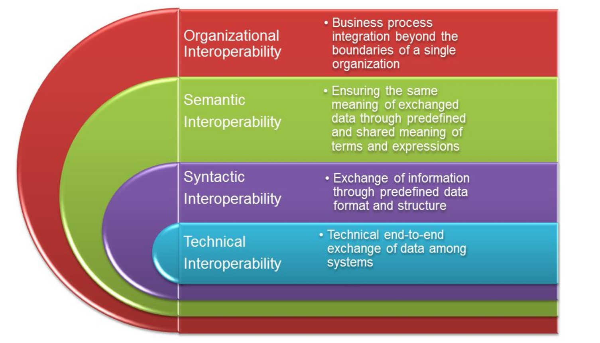

# Pan-Canadian Patient Summary (PS-CA)

## Introduction

The Pan-Canadian Patient Summary (PS-CA) is a standardized extract of a patient’s health record designed to support continuity of care across borders and healthcare settings. It is based on the International Patient Summary (IPS) standard, and adapts this global framework to the Canadian context by incorporating national terminologies and jurisdiction-specific workflows.

The PS-CA enables clinicians to access essential health information—such as medications, allergies, and health concerns—without needing to navigate multiple systems or sift through unstructured notes. It supports both scheduled and unscheduled care, and is designed to be usable across diverse technical environments, including legacy systems and modern FHIR-based platforms.

(Image Source: https://build.fhir.org/ig/HL7/fhir-ips/Structure-of-the-International-Patient-Summary.html)

## Interoperability

Interoperability is foundational to the PS-CA. According to the Health Information Management Systems Society (HIMSS), it encompasses the ability of systems to access, exchange, integrate, and cooperatively use data across organizational and national boundaries. 

(Image Source: Adebesin, F., Foster, R., Kotzé, P., & Van Greunen, D. (2013). A Review of Interoperability Standards in E-health and Imperatives for their Adoption in Africa. South African Computer Journal, 50. https://doi.org/10.18489/sacj.v50i1.176)

Learn more [here](https://legacy.himss.org/resources/interoperability-healthcare).

The PS-CA supports:

- Technical interoperability: Systems can connect and transmit data.
- Structural interoperability: Data follows consistent formats, such as HL7 FHIR.
- Semantic interoperability: Shared terminologies ensure consistent meaning.

## Health Information Exchange Standards

The PS-CA is built on a suite of health information exchange standards that define how data is structured, transmitted, and interpreted:

- ISO 27269: Defines the abstract model for the IPS.
- HL7 FHIR: A modern, web-based standard for health data exchange.
- IHE Profiles: Define real-world workflows, actors, and transactions for IPS exchange.

Canada Health Infoway’s PS-CA Interoperability Specification supports both FHIR and CDA formats, promoting broad adoption across provinces and territories.

## Controlled Terminology Standards

Terminologies and value sets ensure that exchanged data is meaningful and consistently interpreted. The PS-CA uses:

- SNOMED CT Canadian Edition: For clinical concepts.
- LOINC and pCLOCD: For lab and observation data.
- CCDD: For medication data.

These terminologies are maintained by Canada Health Infoway and distributed via the Canadian Standards Release Centre and Terminology Gateway. Value sets are curated subsets of these terminologies, and data elements in the PS-CA are bound to them with varying levels of strictness (e.g., required, preferred, example, etc.).

## FHIR

FHIR (Fast Healthcare Interoperability Resources) is the preferred format for PS-CA implementation. It structures data into modular resources—such as Patient, Condition, and MedicationStatement—and supports exchange via standard web protocols.

The PS-CA FHIR Implementation Guide defines:

- Required and optional data elements.
- Terminology bindings.
- Profiles and extensions.
- Composition structure for the summary.

FHIR enables flexible, scalable, and interoperable patient summary exchange, and is supported by open-source tools like the HAPI FHIR JPA Server.

