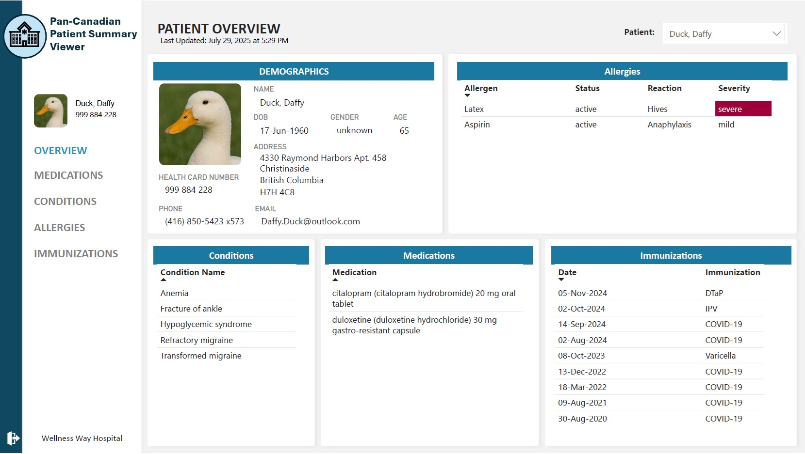
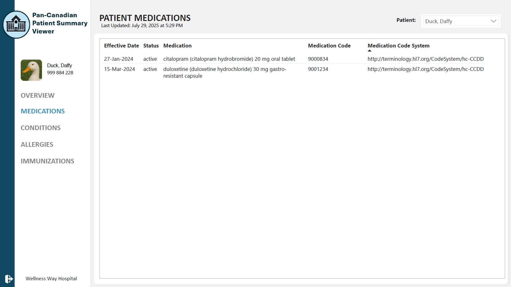
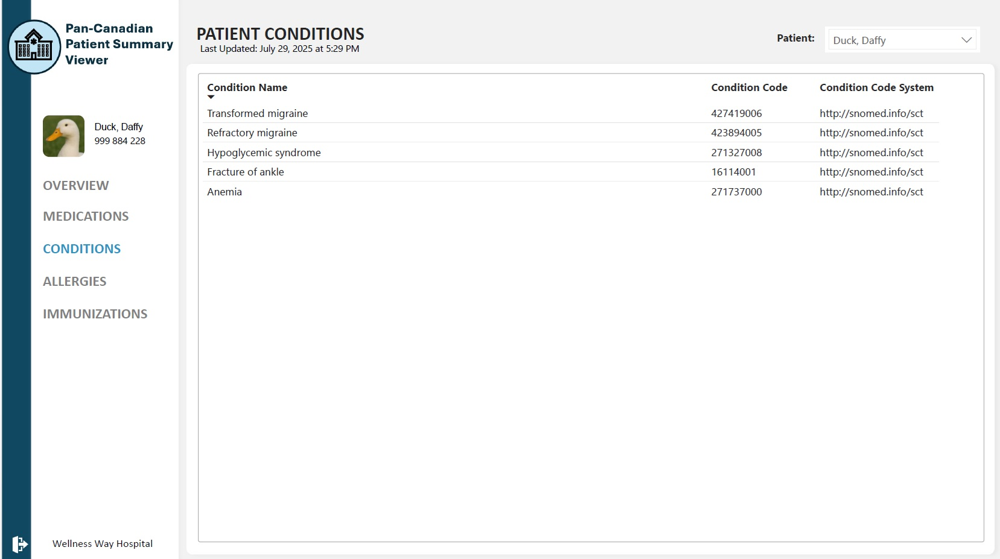
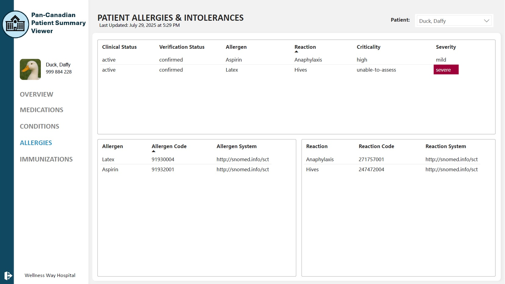
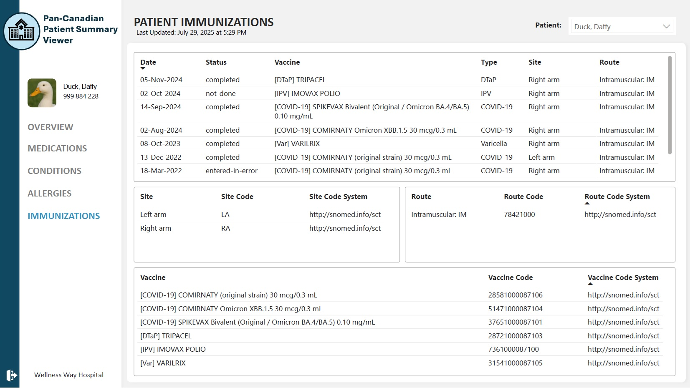
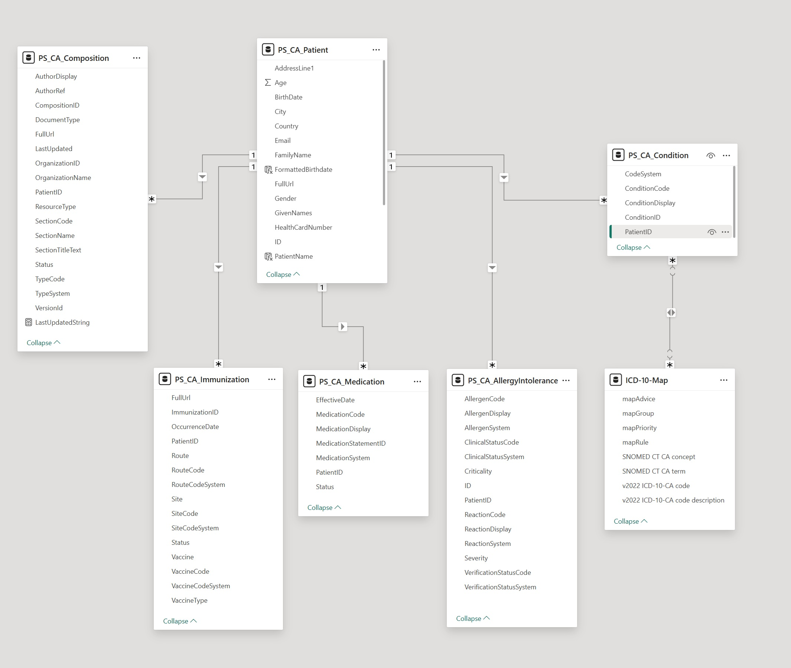

# Using Power Query and Power BI
The Microsoft Power BI desktop application (with built-in Power Query) was used to access the PS-CA patient summaries from the HAPI FHIR server, unpack the .json into tabular format, and display the data in a visual way. 

## Web Connector vs FHIR Connector
Power BI offers multiple ways to connect to FHIR endpoints, including the [Web connector](https://learn.microsoft.com/en-us/power-query/connectors/web/web) and the [dedicated FHIR connector](https://learn.microsoft.com/en-us/power-query/connectors/fhir/fhir). The FHIR connector simplifies access to FHIR resources and supports automatic parsing of FHIR bundles. However, it requires a Power BI account which the author did not have access to. Therefore, in this project the Web connector was used to query the HAPI FHIR server directly. This approach required manual unpacking of the JSON data but provided greater flexibility and control over the transformation process.

### Learn more about the FHIR web connector
#### YouTube
- [Dev Days (2023) FHIR Analytics with Power BI (Michael Hansen)](https://youtu.be/AqFZTf_gVhU?si=fQNXW-dyofKhT5sD)
- [Power BI December 2021 Update - FHIR Connector](https://www.youtube.com/watch?v=iyAmYqTRCLY&t=514s)
#### Blogs
- [Power BI Dashboard for FHIR Server](https://vnbhealth.com/2021/05/power-bi-dashboard-for-fhir-server-vnb-health/)

<br>

# Unpacking json to tabular format
The m code used in Power Query to connect to each FHIR endpoint and unpack the json data into tabular format is below.

### Composition
``` bash
let
    // Step 1: Retrieve Composition resources from local FHIR server
    Source = Json.Document(Web.Contents("http://localhost:8080/fhir/Composition?_count=50&_summary=false")),
    CompositionEntries = Source[entry],

    // Step 2: Convert entry list to table and expand the top-level fields
    ToTable = Table.FromList(CompositionEntries, Splitter.SplitByNothing(), null, null, ExtraValues.Error),
    ExpandedTopLevel = Table.ExpandRecordColumn(ToTable, "Column1", {"fullUrl", "resource"}, {"FullUrl", "Resource"}),

    // Step 3: Expand key fields from the Composition resource
    ExpandedResource = Table.ExpandRecordColumn(ExpandedTopLevel, "Resource", {
        "resourceType", "id", "meta", "status", "type", "subject", 
        "date", "author", "title", "custodian", "section"
    }, {
        "ResourceType", "CompositionID", "Meta", "Status", "Type", "Subject", 
        "Date", "Author", "Title", "Custodian", "Sections"
    }),

    // Step 4: Expand author and subject references
    ExpandedAuthor = Table.ExpandListColumn(ExpandedResource, "Author"),
    ExpandedSubject = Table.ExpandRecordColumn(ExpandedAuthor, "Subject", {"reference"}, {"PatientReference"}),

    // Step 5: Expand custodian organization info
    ExpandedCustodian = Table.ExpandRecordColumn(ExpandedSubject, "Custodian", {"reference", "display"}, {"OrganizationRef", "OrganizationName"}),

    // Step 6: Expand section data
    ExpandedSectionList = Table.ExpandListColumn(ExpandedCustodian, "Sections"),
    ExpandedSectionDetails = Table.ExpandRecordColumn(ExpandedSectionList, "Sections", {"title", "code", "entry"}, {"SectionTitle", "SectionCode", "SectionEntries"}),

    // Step 7: Expand author reference inside section
    ExpandedSectionAuthor = Table.ExpandRecordColumn(ExpandedSectionDetails, "Author", {"reference", "display"}, {"AuthorRef", "AuthorDisplay"}),

    // Step 8: Expand type coding for document type
    ExpandedTypeCoding = Table.ExpandRecordColumn(ExpandedSectionAuthor, "Type", {"coding"}, {"TypeCoding"}),
    ExpandedTypeCodingList = Table.ExpandListColumn(ExpandedTypeCoding, "TypeCoding"),
    ExpandedTypeDetails = Table.ExpandRecordColumn(ExpandedTypeCodingList, "TypeCoding", {"system", "code", "display"}, {"TypeSystem", "TypeCode", "TypeDisplay"}),

    // Step 9: Expand metadata
    ExpandedMeta = Table.ExpandRecordColumn(ExpandedTypeDetails, "Meta", {"versionId", "lastUpdated", "source"}, {"VersionId", "LastUpdated", "Source"}),

    // Step 10: Expand section entries
    ExpandedSectionEntryList = Table.ExpandListColumn(ExpandedMeta, "SectionEntries"),
    ExpandedSectionEntry = Table.ExpandRecordColumn(ExpandedSectionEntryList, "SectionEntries", {"reference"}, {"SectionEntryRef"}),

    // Step 11: Expand section code info
    ExpandedSectionCode = Table.ExpandRecordColumn(ExpandedSectionEntry, "SectionCode", {"coding"}, {"SectionCoding"}),
    ExpandedSectionCodingList = Table.ExpandListColumn(ExpandedSectionCode, "SectionCoding"),
    ExpandedSectionCoding = Table.ExpandRecordColumn(ExpandedSectionCodingList, "SectionCoding", {"system", "code", "display"}, {"SectionCodeSystem", "SectionCodeValue", "SectionDisplay"}),

    // Step 12: Keep only relevant columns for report use
    SelectedColumns = Table.SelectColumns(ExpandedSectionCoding, {
        "FullUrl", "ResourceType", "CompositionID", "VersionId", "LastUpdated", "Status",
        "TypeSystem", "TypeCode", "TypeDisplay", "PatientReference", 
        "AuthorRef", "AuthorDisplay", "OrganizationRef", "OrganizationName", 
        "SectionTitle", "SectionCodeValue", "SectionDisplay"
    }),

    // Step 13: Clean up column names
    RenamedColumns = Table.RenameColumns(SelectedColumns, {
        {"PatientReference", "PatientID"},
        {"OrganizationRef", "OrganizationID"},
        {"SectionCodeValue", "SectionCode"},
        {"SectionDisplay", "SectionName"},
        {"TypeDisplay", "DocumentType"},
        {"SectionTitle", "SectionTitleText"}
    }),

    // Step 14: Clean up Patient ID format
    CleanedPatientID = Table.ReplaceValue(RenamedColumns, "Patient/", "", Replacer.ReplaceText, {"PatientID"}),

    // Step 15: Convert lastUpdated timestamp to datetime type
    ConvertedTypes = Table.TransformColumnTypes(CleanedPatientID, {{"LastUpdated", type datetime}})
in
    ConvertedTypes
```

### Patients
```bash
let
    // Step 1: Load JSON from FHIR Patient endpoint
    Source = Json.Document(Web.Contents("http://localhost:8080/fhir/Patient?_count=50&_summary=false")),
    PatientEntries = Source[entry],

    // Step 2: Convert list to table and expand resource details
    PatientList = Table.FromList(PatientEntries, Splitter.SplitByNothing(), null, null, ExtraValues.Error),
    ExpandedEntry = Table.ExpandRecordColumn(PatientList, "Column1", {"fullUrl", "resource"}, {"FullUrl", "Resource"}),
    ExpandedResource = Table.ExpandRecordColumn(ExpandedEntry, "Resource", {"id", "gender", "birthDate", "identifier", "name", "telecom", "address", "photo"}, {"ID", "Gender", "BirthDate", "Identifier", "Name", "Telecom", "Address", "Photo"}),
    ChangedIDType = Table.TransformColumnTypes(ExpandedResource,{{"ID", type text}}),

    // Step 3: Extract and format patient name fields
    FirstNameOnly = Table.TransformColumns(ChangedIDType, {{"Name", each if List.IsEmpty(_) then null else _{0}}}),
    ExpandedName = Table.ExpandRecordColumn(FirstNameOnly, "Name", {"given", "family"}, {"GivenNames", "FamilyName"}),
    CombinedGivenNames = Table.TransformColumns(ExpandedName, {{"GivenNames", each Text.Combine(_, " "), type text}}),

    // Step 4: Parse birth date and calculate age
    ParsedBirthDate = Table.TransformColumns(CombinedGivenNames, {{"BirthDate", each try Date.From(_) otherwise null, type nullable date}}),
    AddedAge = Table.AddColumn(ParsedBirthDate, "Age", each if [BirthDate] <> null then Number.RoundDown(Duration.Days(Date.From(DateTime.LocalNow()) - [BirthDate]) / 365) else null, Int64.Type),

    // Step 5: Extract Health Card Number (first identifier only)
    FirstIdentifierOnly = Table.TransformColumns(AddedAge, {{"Identifier", each if List.IsEmpty(_) then null else _{0}}}),
    ExpandedIdentifier = Table.ExpandRecordColumn(FirstIdentifierOnly, "Identifier", {"value"}, {"HealthCardNumber"}),

    // Step 6: Expand address fields
    ExpandedAddressList = Table.ExpandListColumn(ExpandedIdentifier, "Address"),
    ExpandedAddressFields = Table.ExpandRecordColumn(ExpandedAddressList, "Address", {"line", "city", "state", "postalCode", "country"}, {"AddressLine1", "City", "State", "PostalCode", "Country"}),
    CombinedAddressLine = Table.TransformColumns(ExpandedAddressFields, {"AddressLine1", each Text.Combine(List.Transform(_, Text.From), ","), type text}),

    // Step 7: Expand telecom fields and pivot by system type (e.g. phone, email)
    ExpandedTelecomList = Table.ExpandListColumn(CombinedAddressLine, "Telecom"),
    ExpandedTelecomFields = Table.ExpandRecordColumn(ExpandedTelecomList, "Telecom", {"system", "value"}),
    PivotedTelecom = Table.Pivot(
        ExpandedTelecomFields,
        List.Distinct(ExpandedTelecomFields[system]),
        "system",
        "value"
    ),
    RenamedTelecomColumns = Table.RenameColumns(PivotedTelecom,{{"phone", "Phone"}, {"email", "Email"}}),

    // Step 8: Expand photo and construct base64 image URI string
    ExpandedPhotoList = Table.ExpandListColumn(RenamedTelecomColumns, "Photo"),
    ExpandedPhotoFields = Table.ExpandRecordColumn(ExpandedPhotoList, "Photo", {"contentType", "data"}, {"Photo.contentType", "Photo.data"}),
    ConstructedPhotoURI = Table.AddColumn(ExpandedPhotoFields, "Photo", each Text.Combine({"data:", [Photo.contentType], ";base64, ", [Photo.data]}, ""))
in
    ConstructedPhotoURI

```
### Conditions
```bash
let
    // Step 1: Load and extract Condition resources from the local FHIR server
    Source = Json.Document(Web.Contents("http://localhost:8080/fhir/Condition?_count=100&_summary=false")),
    ConditionEntries = Source[entry],

    // Step 2: Convert JSON list to table and extract relevant fields
    ToTable = Table.FromList(ConditionEntries, Splitter.SplitByNothing(), null, null, ExtraValues.Error),
    ExpandedTopLevel = Table.ExpandRecordColumn(ToTable, "Column1", {"fullUrl", "resource"}, {"FullUrl", "Resource"}),

    // Step 3: Expand top-level fields from the Condition resource
    ExpandedResource = Table.ExpandRecordColumn(ExpandedTopLevel, "Resource", {"id", "subject", "code"}, {"ConditionID", "Subject", "Code"}),

    // Step 4: Extract Patient ID from the subject reference field
    ExtractedPatientID = Table.AddColumn(ExpandedResource, "PatientID", each Text.AfterDelimiter([Subject][reference], "/")),

    // Step 5: Expand SNOMED CT condition coding
    ExpandedCode = Table.ExpandRecordColumn(ExtractedPatientID, "Code", {"coding"}, {"CodingList"}),
    ExpandedCodingList = Table.ExpandListColumn(ExpandedCode, "CodingList"),
    ExpandedCoding = Table.ExpandRecordColumn(ExpandedCodingList, "CodingList", {"code", "display"}, {"ConditionCode", "ConditionDisplay"}),

    // Step 6: Clean up columns and formatting
    SelectedColumns = Table.SelectColumns(ExpandedCoding, {"ConditionID", "PatientID", "ConditionCode", "ConditionDisplay"}),
    RemovedDisorderSuffix = Table.ReplaceValue(SelectedColumns, " (disorder)", "", Replacer.ReplaceText, {"ConditionDisplay"}),

    // Step 7: Add a fixed column for the code system used
    AddCodeSystem = Table.AddColumn(RemovedDisorderSuffix, "CodeSystem", each "http://snomed.info/sct")

in
    AddCodeSystem
```

### Immunizations
```bash
let
    // Step 1: Retrieve Immunization resources from the local FHIR server
    Source = Json.Document(Web.Contents("http://localhost:8080/fhir/Immunization?_count=100&_summary=false")),
    ImmunizationEntries = Source[entry],

    // Step 2: Convert the list of entries to a table and expand top-level columns
    ToTable = Table.FromList(ImmunizationEntries, Splitter.SplitByNothing(), null, null, ExtraValues.Error),
    ExpandedEntry = Table.ExpandRecordColumn(ToTable, "Column1", {"fullUrl", "resource", "search"}, {"FullUrl", "Resource", "Search"}),

    // Step 3: Expand fields from the Immunization resource
    ExpandedResource = Table.ExpandRecordColumn(ExpandedEntry, "Resource", {
        "resourceType", "id", "meta", "status", "vaccineCode", 
        "patient", "occurrenceDateTime", "primarySource", "site", "route"
    }, {
        "ResourceType", "ImmunizationID", "Meta", "Status", "VaccineCode", 
        "Patient", "OccurrenceDate", "PrimarySource", "Site", "Route"
    }),
    ParsedOccurrenceDate = Table.TransformColumns(ExpandedResource,{{"OccurrenceDate", each Date.From(DateTimeZone.From(_)), type date}}),

    // Step 4: Expand vaccine code details
    ExpandedVaccineCode = Table.ExpandRecordColumn(ParsedOccurrenceDate, "VaccineCode", {"coding"}, {"VaccineCoding"}),
    ExpandedVaccineCodingList = Table.ExpandListColumn(ExpandedVaccineCode, "VaccineCoding"),
    ExpandedVaccineCoding = Table.ExpandRecordColumn(ExpandedVaccineCodingList, "VaccineCoding", {"system", "code", "display"}, {"VaccineCodeSystem", "VaccineCode", "Vaccine"}),
    ExtractVaccineType = Table.AddColumn(ExpandedVaccineCoding, "VaccineType", each Text.BetweenDelimiters([Vaccine], "[", "]"), type text),
    ReplaceInfWithInfluenza = Table.ReplaceValue(ExtractVaccineType,"Inf","Influenza",Replacer.ReplaceText,{"VaccineType"}),
    ReplaceVarWithVaricella = Table.ReplaceValue(ReplaceInfWithInfluenza,"Var","Varicella",Replacer.ReplaceText,{"VaccineType"}),

    // Step 5: Extract Patient ID from the patient reference
    ExpandedPatient = Table.ExpandRecordColumn(ReplaceVarWithVaricella, "Patient", {"reference"}, {"PatientReference"}),
    ExtractedPatientID = Table.ReplaceValue(ExpandedPatient, "Patient/", "", Replacer.ReplaceText, {"PatientReference"}),

    // Step 6: Expand site details (e.g. injection site)
    ExpandedSite = Table.ExpandRecordColumn(ExtractedPatientID, "Site", {"coding"}, {"SiteCoding"}),
    ExpandedSiteList = Table.ExpandListColumn(ExpandedSite, "SiteCoding"),
    ExpandedSiteCoding = Table.ExpandRecordColumn(ExpandedSiteList, "SiteCoding", {"system", "code", "display"}, {"SiteCodeSystem", "SiteCode", "Site"}),

    // Step 7: Expand route details (e.g. intramuscular)
    ExpandedRoute = Table.ExpandRecordColumn(ExpandedSiteCoding, "Route", {"coding"}, {"RouteCoding"}),
    ExpandedRouteList = Table.ExpandListColumn(ExpandedRoute, "RouteCoding"),
    ExpandedRouteCoding = Table.ExpandRecordColumn(ExpandedRouteList, "RouteCoding", {"system", "code", "display"}, {"RouteCodeSystem", "RouteCode", "Route"}),

    // Step 8: Remove unneeded metadata fields
    RemovedExtras = Table.RemoveColumns(ExpandedRouteCoding, {"Meta", "ResourceType", "PrimarySource", "Search"}),

    // Step 9: Rename columns for clarity
    RenamedColumns = Table.RenameColumns(RemovedExtras, {"PatientReference", "PatientID"})
in
    RenamedColumns
```

### Medications
```bash
let
    // Step 1: Retrieve MedicationStatement resources from the local FHIR server
    Source = Json.Document(Web.Contents("http://localhost:8080/fhir/MedicationStatement?_count=100&_summary=false")),
    MedicationEntries = Source[entry],

    // Step 2: Convert the list of entries into a table and expand the main columns
    ToTable = Table.FromList(MedicationEntries, Splitter.SplitByNothing(), null, null, ExtraValues.Error),
    ExpandedEntry = Table.ExpandRecordColumn(ToTable, "Column1", {"fullUrl", "resource", "search"}, {"FullUrl", "Resource", "Search"}),

    // Step 3: Expand fields from the resource object
    ExpandedResource = Table.ExpandRecordColumn(ExpandedEntry, "Resource", {"resourceType", "id", "meta", "status", "medicationCodeableConcept", "subject"}, {"ResourceType", "ID", "Meta", "Status", "MedicationCodeableConcept", "Subject"}),

    // Step 4: Expand metadata to access versioning and timestamp info
    ExpandedMeta = Table.ExpandRecordColumn(ExpandedResource, "Meta", {"versionId", "lastUpdated", "source"}, {"VersionId", "LastUpdated", "Source"}),

    // Step 5: Expand the medication codeable concept to access codings
    ExpandedMedicationConcept = Table.ExpandRecordColumn(ExpandedMeta, "MedicationCodeableConcept", {"coding"}, {"Coding"}),

    // Step 6: Unpack the list of codings into individual rows (in case of multiple codings per medication)
    ExpandedCodingList = Table.ExpandListColumn(ExpandedMedicationConcept, "Coding"),

    // Step 7: Expand each coding object to get system, code, and display text
    ExpandedCoding = Table.ExpandRecordColumn(ExpandedCodingList, "Coding", {"system", "code", "display"}, {"System", "MedicationCode", "MedicationDisplay"}),

    // Step 8: Extract patient ID from subject.reference (e.g. "Patient/123" becomes "123")
    ExpandedSubject = Table.ExpandRecordColumn(ExpandedCoding, "Subject", {"reference"}, {"PatientReference"}),
    ExtractedPatientID = Table.ReplaceValue(ExpandedSubject, "Patient/", "", Replacer.ReplaceText, {"PatientReference"}),

    // Step 9: Rename columns for clarity
    RenamedPatientID = Table.RenameColumns(ExtractedPatientID, {{"PatientReference", "PatientID"}}),

    // Step 10: Keep only the necessary columns
    SelectedColumns = Table.SelectColumns(RenamedPatientID, {"ID", "PatientID", "MedicationCode", "MedicationDisplay", "Status", "System"}),

    // Step 11: Final column renaming for clarity
    FinalOutput = Table.RenameColumns(SelectedColumns, {{"ID", "MedicationStatementID"}})
in
    FinalOutput
```

### Allergies
```bash
let
    // Step 1: Load JSON data from the FHIR AllergyIntolerance endpoint
    Source = Json.Document(Web.Contents("http://localhost:8080/fhir/AllergyIntolerance?_count=100")),
    AllergyEntries = Source[entry],

    // Step 2: Convert list of entries into a table and expand top-level entry fields
    AllergyList = Table.FromList(AllergyEntries, Splitter.SplitByNothing(), null, null, ExtraValues.Error),
    ExpandedEntry = Table.ExpandRecordColumn(AllergyList, "Column1", {"fullUrl", "resource"}, {"FullUrl", "Resource"}),

    // Step 3: Expand key fields from the resource
    ExpandedResource = Table.ExpandRecordColumn(ExpandedEntry, "Resource", {"id", "patient", "code", "reaction", "criticality"}, {"ID", "Patient", "Substance", "Reaction", "Criticality"}),

    // Step 4: Extract patient ID from the Patient reference (e.g. "Patient/12345" -> "12345")
    ExtractedPatientRef = Table.AddColumn(ExpandedResource, "PatientID", each Text.AfterDelimiter([Patient][reference], "/")),

    // Step 5: Expand allergen substance coding to get code and display
    SubstanceCoding = Table.ExpandRecordColumn(ExtractedPatientRef, "Substance", {"coding"}, {"Coding"}),
    ExpandedCodingList = Table.ExpandListColumn(SubstanceCoding, "Coding"),
    ExpandedCoding = Table.ExpandRecordColumn(ExpandedCodingList, "Coding", {"code", "display"}, {"AllergenCode", "AllergenDisplay"}),

    // Step 6: Expand the first reaction and its manifestations (if any)
    FirstReactionOnly = Table.TransformColumns(ExpandedCoding, {{"Reaction", each if List.IsEmpty(_) then null else _{0}}}),
    ExpandedReaction = Table.ExpandRecordColumn(FirstReactionOnly, "Reaction", {"manifestation", "severity"}, {"ManifestationList", "Severity"}),

    // Step 7: Expand first manifestation coding to get reaction display text
    FirstManifestation = Table.TransformColumns(ExpandedReaction, {{"ManifestationList", each if List.IsEmpty(_) then null else _{0}}}),
    ExpandedManifestation = Table.ExpandRecordColumn(FirstManifestation, "ManifestationList", {"coding"}, {"ManifestationCoding"}),
    ManifestationCodeList = Table.ExpandListColumn(ExpandedManifestation, "ManifestationCoding"),
    ExpandedManifestationCode = Table.ExpandRecordColumn(ManifestationCodeList, "ManifestationCoding", {"code", "display"}, {"ReactionCode", "ReactionDisplay"}),

    // Step 8: Keep only final columns of interest
    FinalOutput = Table.SelectColumns(ExpandedManifestationCode, {"ID", "PatientID", "AllergenCode", "AllergenDisplay", "ReactionCode", "ReactionDisplay", "Severity", "Criticality"})
in
    FinalOutput
```

<br>

# User Interface
The following screenshots show the user interface.






## Relating tables
All tables were related using the PatientID columns.



<br>

# Publish to Power BI Service
Due to the fact that the author did not have access to a Power BI account, it was not possible to publish the report to the Power BI service.